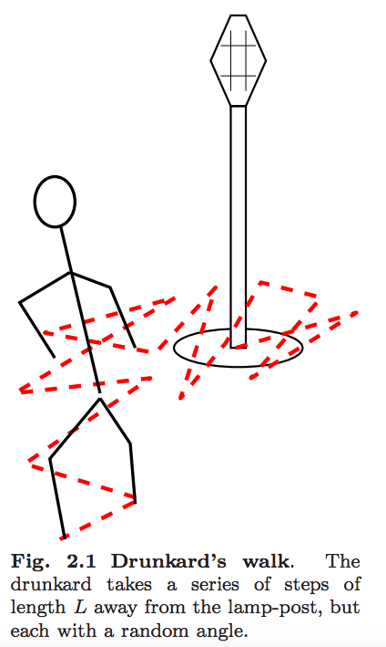

This week, while reading around phonons and Goldstone bosons, I followed a link to Setha's stat mech book, which happily combines both in a single paragraph. The text, <em>Entropy, Order Parameters and Complexity</em>, can be downloaded (for free!) from his website - something I liked so much I ordered a copy of the real thing.

From an hour or two of focused dives and a bit of skimming, the book is great. It has a casual style of writing that reads quick and easy on highly interesting subject matter.

High-point sections so far include:
- Why stochastic errors scale like N^-0.5 - very relevant for MD simulations
- Goldstone theorem - enlightening in the context of lattice dynamics
- Algorithms for practical computations e.g. Monte Carlo Metropolis
- Fluctuations, Cauchy theorem, and causality - great basic stuff 

Also double-plus good - useful looking technical notes in the Appendices on Fourier Transforms, and the essential-stuff-every-physicist-must-know bits and pieces on the insides of the front and back pages.

Find it: <a href="http://pages.physics.cornell.edu/~sethna/StatMech/EntropyOrderParametersComplexity.pdf">Setha-entropy-order-complexity</a>

